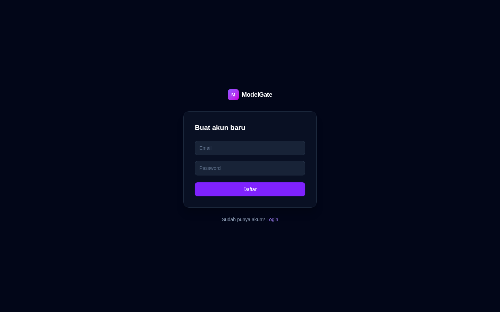
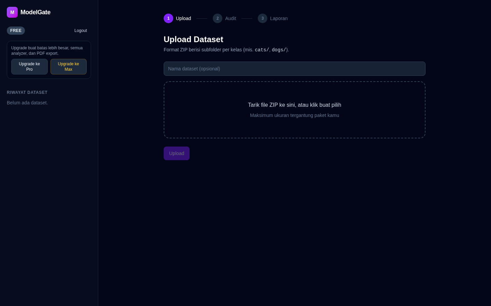
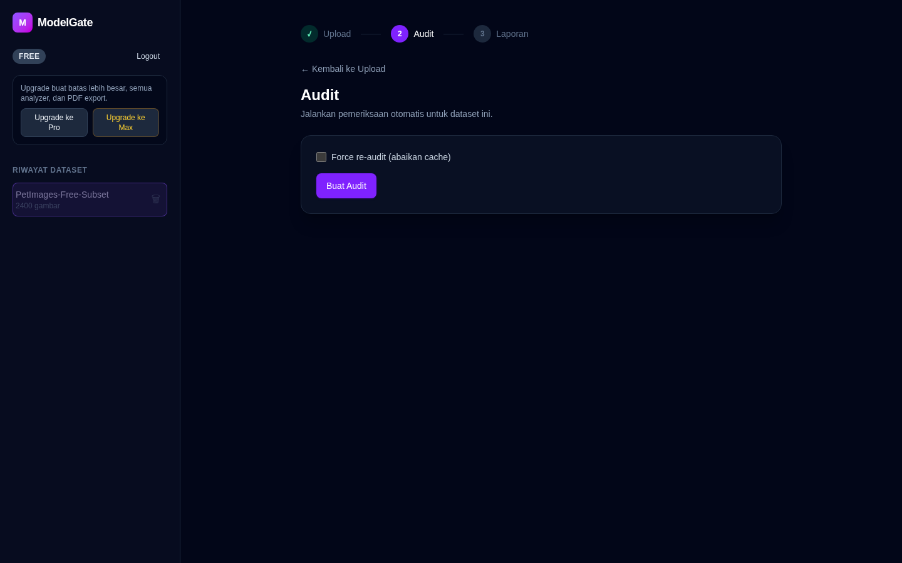
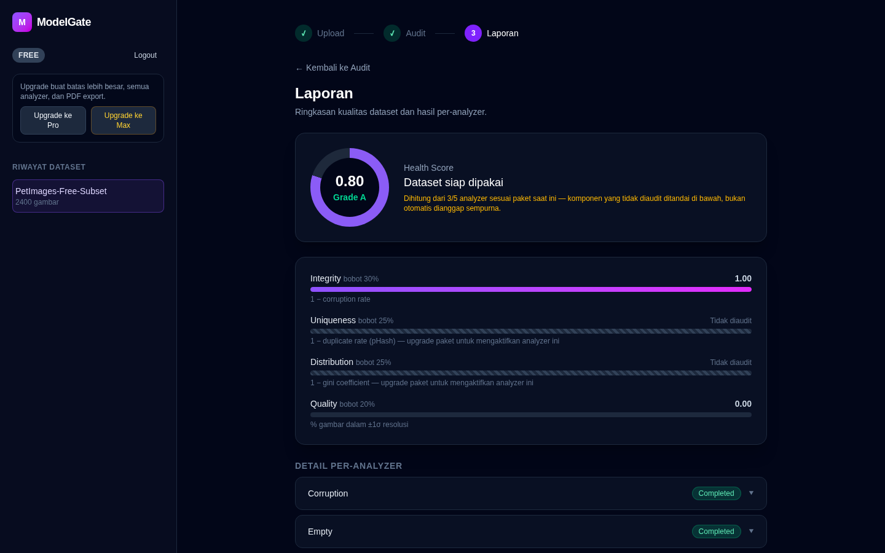
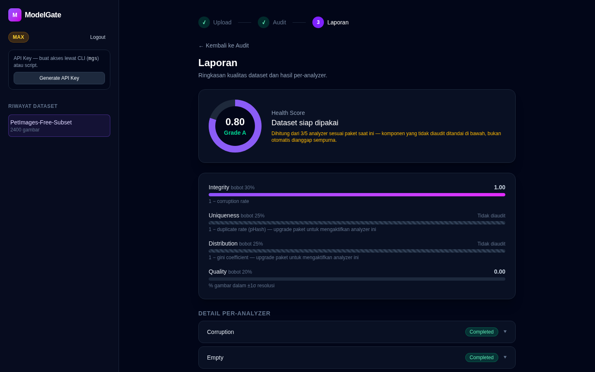
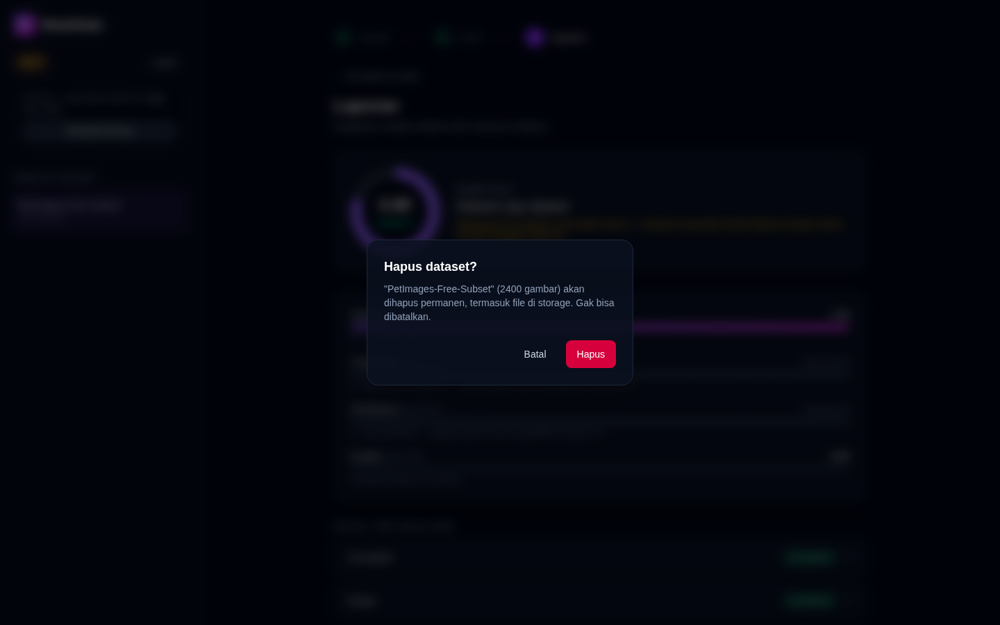
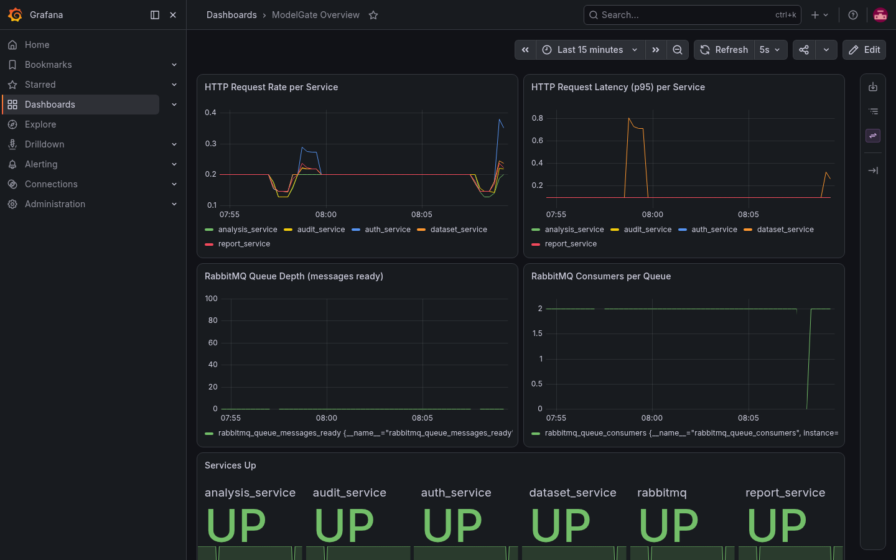
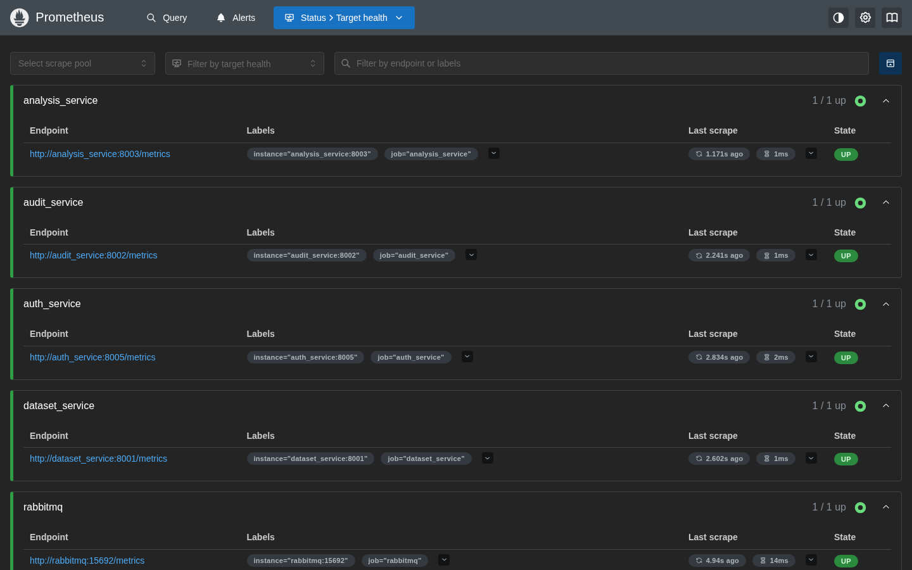

# ModelGate — CV Dataset Quality Audit

**Repository:** https://github.com/agriby-chaniago/MGS

Platform audit kualitas dataset Computer Vision berbasis microservices. Upload dataset ZIP, jalankan audit otomatis (corruption, resolution, distribution, duplikat), dan dapatkan laporan dengan Health Score.

> **Konteks:** Project ini dikembangkan untuk UAS mata kuliah **Web Service** dan **Pemrograman Berbasis Platform** (S1 Informatika, Semester 6). Lihat [Kaitan ke Mata Kuliah](#kaitan-ke-mata-kuliah) di bagian bawah untuk pemetaan fitur ke konsep tiap mata kuliah, dan [`VIDEO_SCRIPT.md`](VIDEO_SCRIPT.md) / [`SLIDES.pdf`](SLIDES.pdf) untuk materi presentasi.

---

## Fitur Utama

**Inti (audit dataset):**
- Upload dataset ZIP, validasi struktur otomatis, dedup via SHA-256
- 5 analyzer: corruption, empty, resolution, distribution, duplicate (pHash)
- Health Score dengan grade A–F, laporan PDF
- Progress audit real-time (WebSocket)

**Ditambahkan untuk UAS:**
- Autentikasi JWT dengan 3 tier paket (Free / Pro / Max), masing-masing beda batas upload, jumlah analyzer, kuota harian, dan akses PDF
- API Key + CLI (`mgs`) untuk akses terprogram, di luar browser
- Frontend baru berbasis React + Vite + Tailwind (paralel dengan Streamlit lama, dua-duanya tetap jalan)
- Rate limiting di API Gateway (Nginx)
- Observability — Prometheus + Grafana (dashboard siap pakai)
- Horizontal scaling pada service analisis gambar
- CI/CD — GitHub Actions build & push image ke GHCR

---

## Arsitektur

```
Browser ──┬─→ React (3000)
          └─→ Streamlit (8501)
                    ↓
              Nginx (8080)  ← API Gateway + auth_request + rate limit
       /    |     |     |      \
   dataset audit analysis report auth
   (8001) (8002)  (8003) (8004) (8005)
       \     |      |      |     /
        PostgreSQL  MinIO  RabbitMQ
                              │
                     analysis_service (consumer, scalable)

CLI (mgs) ──→ Nginx (8080), via API Key

Prometheus (9090) ──scrape──→ semua service + RabbitMQ
Grafana (3001) ──query──→ Prometheus
```

| Service | Port | Fungsi |
|---|---|---|
| React frontend | 3000 | UI baru (Tailwind, WebSocket live progress) |
| Streamlit | 8501 | UI lama (tetap dipertahankan) |
| Nginx | 8080 | API Gateway — auth, rate limit, routing |
| dataset_service | 8001 | Upload & manajemen dataset |
| audit_service | 8002 | Orkestrasi audit, WebSocket broadcast |
| analysis_service | 8003 | Analisis gambar (5 analyzer), consumer RabbitMQ |
| report_service | 8004 | Laporan, Health Score, PDF |
| auth_service | 8005 | JWT, API Key, tier — **baru untuk UAS** |
| PostgreSQL | 5432 | Database utama (1 DB, schema terpisah per service) |
| MinIO | 9000/9001 | Object storage (gambar) |
| RabbitMQ | 5672/15672/15692 | Message queue + metrics plugin |
| Prometheus | 9090 | Metrics collection |
| Grafana | 3001 | Dashboard observability |
| pgAdmin | 5050 | Database admin UI |

Prinsip arsitektur: **bounded context** — tiap service hanya menulis ke schema database miliknya sendiri; baca lintas service pakai model *read-only mirror*. Nginx hanya melakukan **autentikasi** (siapa kamu), **otorisasi** (boleh apa) tetap jadi tanggung jawab masing-masing service. Detail lengkap ada di [`ARCHITECTURE.md`](ARCHITECTURE.md).

---

## Paket / Tier

| Tier | Upload Maks | Analyzer | Kuota Audit/Hari | Download PDF |
|---|---|---|---|---|
| **Free** | 150MB | 3 dari 5 | 3 | ✗ |
| **Pro** | 1024MB | 5 | 20 | ✓ |
| **Max** | 2048MB | 5 | Tidak terbatas | ✓ |

Semua akun baru default **Free**. Upgrade bisa dilakukan sendiri lewat tombol di sidebar aplikasi (tanpa pembayaran sungguhan — ini demo/UAS scope) atau lewat API `POST /api/v1/auth/upgrade`.

---

## Screenshot

| | |
|---|---|
| **Login** | **Register** |
|  |  |
| **Upload dataset (Free tier)** | **Mulai audit** |
|  |  |
| **Progress audit real-time (WebSocket)** | **Laporan — Free tier** |
|  |  |

Perhatikan di laporan Free tier: komponen **Uniqueness** dan **Distribution** ditandai jelas **"Tidak diaudit"** (bergaris, bukan angka) karena analyzer `duplicate` dan `distribution` tidak jalan di paket Free — bukan otomatis dianggap sempurna (nilai 1.00 semu). Ini perbaikan atas bug transparansi Health Score yang ditemukan saat pengujian.

| | |
|---|---|
| **Upgrade ke Max** | **Generate API Key untuk CLI** |
|  |  |
| **Laporan — Max tier (semua analyzer + PDF)** | **Konfirmasi hapus dataset** |
|  |  |
| **Grafana — dashboard observability** | **Prometheus — status target** |
|  |  |

---

## Requirements

- Docker & Docker Compose
- 4GB RAM minimum (dataset besar butuh lebih)
- Python 3.11+ dan Node.js 20+ jika ingin develop di luar Docker
- Port 3000, 3001, 5050, 8080, 8501, 9000, 9001, 9090, 15672 tidak dipakai proses lain

---

## Cara Menjalankan

### 1. Clone & konfigurasi

```bash
git clone <repo-url>
cd MGS
cp .env.example .env
```

File `.env` berisi kredensial default untuk development, termasuk `JWT_SECRET`. **Jangan commit `.env` ke repository** (sudah di-gitignore).

### 2. Jalankan semua service

```bash
docker compose up -d --build
docker compose restart nginx   # WAJIB setiap habis --build, lihat catatan di bawah
```

Tunggu sampai semua container healthy (±1-2 menit, terutama PostgreSQL dan RabbitMQ). Cek status:

```bash
docker compose ps
```

> **Penting — gotcha yang sering ketemu:** Nginx pakai image resmi (`nginx:alpine`), bukan hasil build sendiri. Kalau ada service lain yang di-`--build` ulang, container itu dapat IP baru, tapi Nginx tidak otomatis tahu — **selalu jalankan `docker compose restart nginx` setelah rebuild service apapun**, atau request akan gagal dengan 502.

### 3. Akses aplikasi

| URL | Keterangan |
|---|---|
| http://localhost:3000 | Frontend React (baru) |
| http://localhost:8501 | Frontend Streamlit (lama, tetap berfungsi) |
| http://localhost:8080 | API Gateway (Nginx) |
| http://localhost:8080/docs/ | API Documentation (RapiDoc) |
| http://localhost:3001 | Grafana (`admin` / `admin`) |
| http://localhost:9090 | Prometheus |
| http://localhost:9001 | MinIO Console (`minioadmin` / `minioadmin123`) |
| http://localhost:15672 | RabbitMQ Management (`guest` / `guest`) |
| http://localhost:5050 | pgAdmin |

---

## Alur Penggunaan

### Lewat Browser (React atau Streamlit)

```
1. Daftar / Login
   └── Akun baru otomatis paket Free

2. (Opsional) Upgrade Paket
   └── Tombol "Upgrade ke Pro/Max" di sidebar — self-service, tanpa pembayaran

3. Upload Dataset ZIP
   └── Format: ZIP berisi subfolder per kelas
       Contoh: dataset.zip/cats/, dataset.zip/dogs/
       Batas ukuran sesuai paket (lihat tabel Tier)

4. Jalankan Audit
   └── Analyzer yang jalan ditentukan otomatis sesuai paket:
       - Corruption  : deteksi file gambar rusak
       - Empty       : deteksi folder/kelas kosong
       - Resolution  : analisis distribusi resolusi
       - Distribution: keseimbangan antar kelas (Gini)
       - Duplicate   : deteksi gambar duplikat (pHash)
   └── Progress ditampilkan real-time lewat WebSocket

5. Lihat Laporan
   └── Health Score (0-1) dengan grade A/B/C/D/F
       Komponen: Integrity (30%), Uniqueness (25%),
                 Distribution (25%), Quality (20%)
       Download PDF (Pro/Max saja)
```

### Lewat CLI (`mgs`) — akses terprogram

Ditujukan untuk paket Pro/Max, tanpa perlu buka browser sama sekali.

```bash
# 1. Generate API Key dari browser — panel "API Key" di sidebar (Pro/Max saja)

# 2. Install dependency CLI (sekali saja)
pip install -r cli/requirements.txt

# 3. Simpan API Key (langsung tervalidasi saat itu juga)
python3 cli/mgs.py configure --key mg_live_xxxxxxxx --base-url http://localhost:8080

# 4. Jalankan audit end-to-end dalam satu command
python3 cli/mgs.py run dataset.zip --pdf
```

Command lain yang tersedia: `mgs upload`, `mgs audit <dataset_id>`, `mgs status <audit_id>`, `mgs report <audit_id> --pdf`. Jalankan `mgs --help` untuk panduan lengkap.

Tips: tambahkan alias biar tidak perlu ketik `python3 cli/mgs.py` setiap saat:
```bash
echo 'alias mgs="python3 '"$(pwd)"'/cli/mgs.py"' >> ~/.zshrc   # atau ~/.bashrc
```

---

## API Documentation

Dokumentasi interaktif tersedia via **RapiDoc** — buka `http://localhost:8080/docs/` saat stack jalan, atau buka `docs/index.html` langsung di browser (tanpa docker).

### Refresh specs (opsional)

Setelah ada perubahan endpoint, generate ulang spec dari service yang sedang jalan:

```bash
bash docs/generate_specs.sh
```

Lalu commit `docs/openapi/*.json`.

---

## API Endpoints

### Auth Service — *baru untuk UAS*
```
POST   /api/v1/auth/register        Daftar akun baru (default paket Free)
POST   /api/v1/auth/login           Login, dapat JWT
GET    /api/v1/auth/me              Info akun yang sedang login
POST   /api/v1/auth/upgrade         Upgrade paket (self-service, demo-only)
POST   /api/v1/auth/api-keys        Generate API Key (Pro/Max saja)
```

### Dataset Service
```
POST   /api/v1/datasets/upload      Upload dataset ZIP (batas sesuai paket)
GET    /api/v1/datasets             List dataset milik sendiri
GET    /api/v1/datasets/{id}        Detail dataset + kelas
DELETE /api/v1/datasets/{id}        Soft delete dataset
```

### Audit Service
```
POST   /api/v1/audits               Buat audit baru (analyzer ditentukan server sesuai paket)
GET    /api/v1/audits/{id}          Status audit
POST   /api/v1/audits/{id}/retry    Retry audit yang gagal
WS     /ws/audits/{id}              Live progress per-analyzer — baru untuk UAS
```

### Report Service
```
GET    /api/v1/reports/{audit_id}          Hasil per-analyzer + findings
GET    /api/v1/reports/{audit_id}/summary  Health score & komponen
GET    /api/v1/reports/{audit_id}/pdf      Download PDF (Pro/Max saja)
```

Semua endpoint di atas (kecuali `/api/v1/auth/register` dan `/api/v1/auth/login`) wajib membawa `Authorization: Bearer <jwt>` atau `X-API-Key: <key>`.

---

## Observability

- **Prometheus** (`localhost:9090/targets`) — scrape metrik dari 5 backend service + plugin metrics RabbitMQ, otomatis lewat `prometheus-fastapi-instrumentator`, tanpa kode tambahan di masing-masing endpoint.
- **Grafana** (`localhost:3001`, login `admin`/`admin`) — dashboard **"ModelGate Overview"** sudah ter-provisioning otomatis saat startup (request rate & latency per service, kedalaman antrian RabbitMQ, jumlah consumer, status up/down semua service). Datasource Prometheus juga sudah otomatis tersambung, tidak perlu setup manual.

---

## Horizontal Scaling

`analysis_service` terhubung ke RabbitMQ sebagai consumer — menjalankan lebih dari satu instance otomatis membagi beban tanpa kode load-balancing tambahan:

```bash
docker compose up -d --scale analysis_service=3
sleep 5   # beri waktu semua replika konek ke RabbitMQ
docker compose exec rabbitmq rabbitmqctl list_consumers   # harus muncul 3 consumer untuk queue audit.jobs

# kembalikan ke 1 replika setelah selesai
docker compose up -d --scale analysis_service=1
```

---

## CI/CD

`.github/workflows/build.yml` — build dan push image Docker tiap service ke **GitHub Container Registry (GHCR)** secara otomatis setiap push ke branch `main`.

---

## Development

### Rebuild satu service

```bash
docker compose up -d --build <service_name>
docker compose restart nginx   # WAJIB setelah rebuild apapun
```

### Lihat logs

```bash
docker compose logs -f <service_name>
# Contoh:
docker compose logs -f analysis_service
docker compose logs -f audit_service
```

### Matikan semua service

```bash
docker compose down          # Matikan, data tetap ada
docker compose down -v       # Matikan + hapus semua data (reset total)
```

### Struktur direktori

```
MGS/
├── dataset_service/    FastAPI — upload & dataset management
├── audit_service/      FastAPI — audit orchestration + WebSocket + RabbitMQ publisher
├── analysis_service/   FastAPI — 5 image analyzers + RabbitMQ consumer (scalable)
├── report_service/     FastAPI — health score + PDF generation
├── auth_service/       FastAPI — JWT, API Key, tier — baru untuk UAS
├── frontend/            React + Vite + Tailwind — UI baru
├── streamlit_app/      Streamlit UI — dipertahankan paralel
├── cli/                 mgs.py — CLI Python untuk akses terprogram
├── shared/              Kode bersama (response format, dll)
├── nginx/               nginx.conf (API gateway: auth_request, rate limit, CORS)
├── rabbitmq/             Dockerfile custom (plugin Prometheus)
├── observability/        Konfigurasi Prometheus + provisioning Grafana
├── docs/                API documentation (RapiDoc)
│   ├── index.html          UI docs
│   ├── rapidoc-min.js      RapiDoc bundled (offline)
│   ├── generate_specs.sh   Refresh OpenAPI specs dari running services
│   └── openapi/            OpenAPI 3.0 JSON per service
├── .github/workflows/   CI/CD — build & push image ke GHCR
├── docker-compose.yml
├── ARCHITECTURE.md      Detail arsitektur & keputusan desain
├── PRD.md               Product requirements
├── VIDEO_SCRIPT.md      Script presentasi UAS
├── SLIDES.md / SLIDES.pdf  Slide presentasi (format Marp)
└── .env.example         Template konfigurasi (salin ke .env)
```

---

## Kaitan ke Mata Kuliah

### Web Service
- **REST API + API Gateway** — Nginx sebagai satu pintu masuk untuk semua service
- **Dua skema autentikasi** — JWT (untuk pengguna lewat browser) dan API Key (untuk akses terprogram lewat CLI/script)
- **Komunikasi real-time** — WebSocket untuk progress audit, menggantikan polling
- **Rate limiting** — pembatasan request berbasis IP di API Gateway

### Pemrograman Berbasis Platform
- **Containerization** — seluruh stack berjalan di Docker & Docker Compose
- **Message queue asinkron** — RabbitMQ untuk proses analisis gambar yang berat
- **Observability** — Prometheus (metrics) + Grafana (visualisasi)
- **Horizontal scaling** — multiple consumer instance dibagi beban otomatis oleh RabbitMQ
- **CI/CD** — automasi build & publish image lewat GitHub Actions

Kubernetes secara sadar tidak dimasukkan ke scope UAS ini — pertimbangan trade-off antara kompleksitas setup dan waktu yang tersedia untuk implementasi serta pengujian yang matang pada fitur lain.
